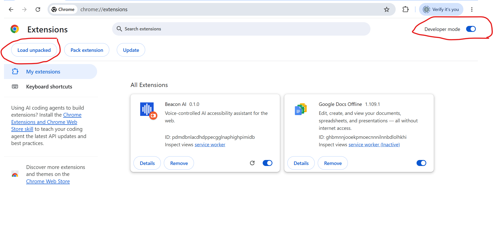
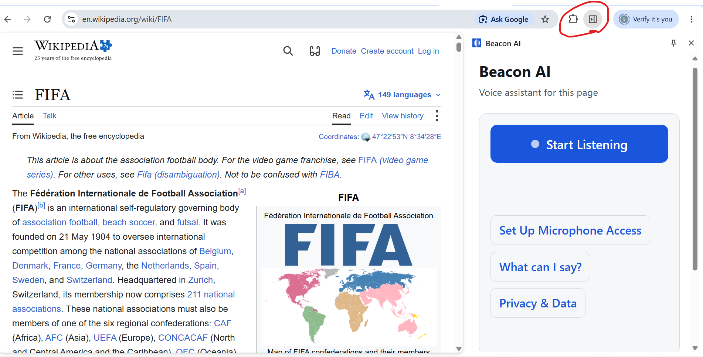
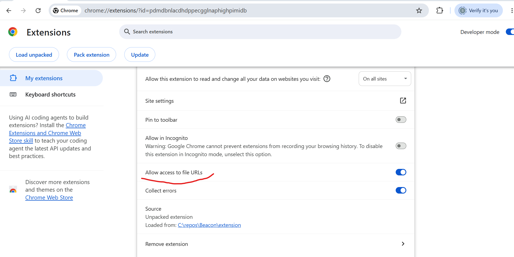
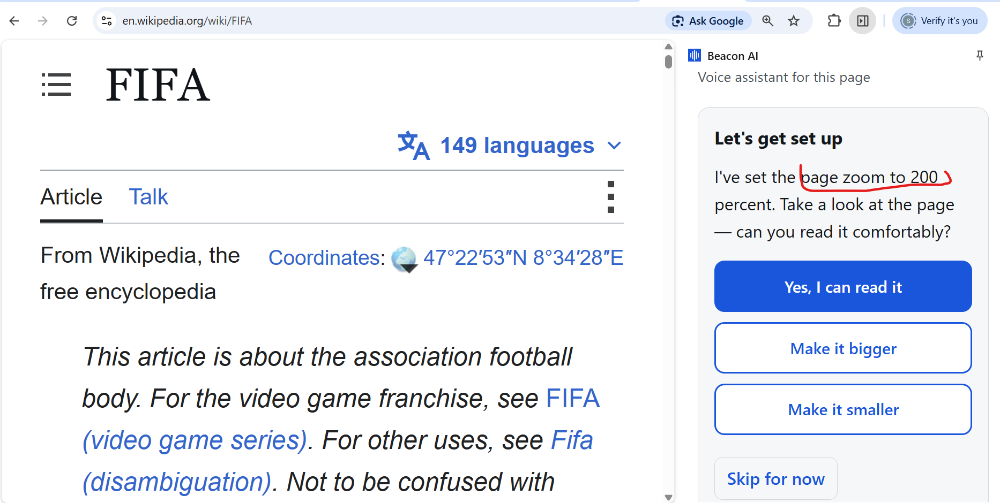
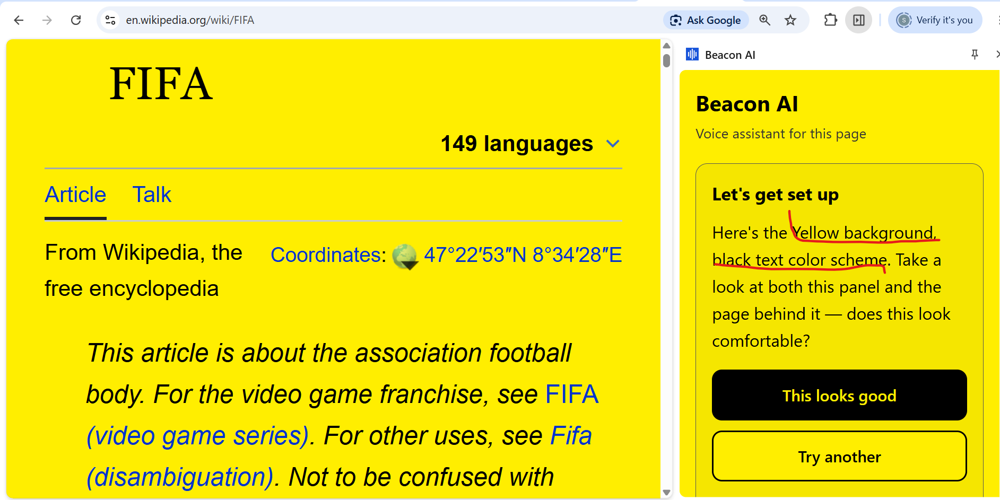
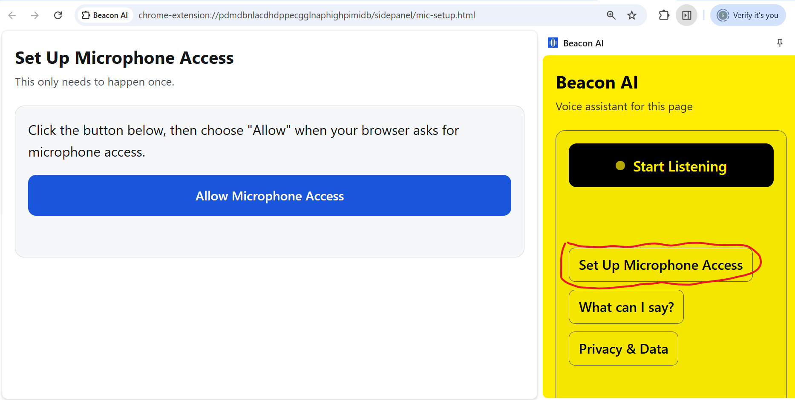

# Beacon AI

A voice-controlled, AI-powered accessibility browser extension for Chrome — built for blind and low-vision users (see `PROJECT_PLAN.md` for the full product spec and design context).

This document is the developer manual: how to install it, run it, and try it out.

---

## What's in this repo

```
Beacon/
  extension/     — the Chrome extension itself (Manifest V3)
  backend/       — FastAPI backend that calls the Claude API (already deployed to Railway)
  PROJECT_PLAN.md — full product spec, design principles, open questions
```

---

## Quickest way to try it (no backend setup needed)

The extension already points at a **deployed backend** (Railway), so you don't need to run anything locally just to try Beacon AI out.

1. Open Chrome and go to `chrome://extensions`
2. Turn on **Developer mode** (top-right toggle)
3. Click **Load unpacked**
4. Select the `extension/` folder from this repo



5. Pin the extension (puzzle-piece icon in the toolbar → pin Beacon AI)
6. Click the Beacon AI icon — it opens a side panel, not a popup



**Allow local file access** (needed for the PDF-reading feature, and for anything read from a local file):
- Go to `chrome://extensions`, find Beacon AI → **Details**
- Toggle **"Allow access to file URLs"** on



### First run

The panel walks you through a short setup automatically the first time: speech rate, page zoom, and contrast theme, each calibrated by trying it live and confirming it's comfortable. You can redo this any time — say **"redo setup"** or click the **Redo Setup** link in the panel.

Zoom calibration applies a candidate zoom to the real page behind the panel, not just a description:



Theme calibration previews live on both the panel and the page at once:



Once a theme is chosen, it applies to any page you read — not just the panel. Here's the same Wikipedia article in all four themes:


### Microphone permission (one-time, Chrome-specific quirk)

Chrome doesn't reliably prompt for microphone access from inside a side panel — this is a known Chrome limitation, not a bug in the extension. If voice input doesn't work the first time:

1. Click **"Set Up Microphone Access"** in the panel (appears automatically if this happens)
2. A new tab opens with one button — click **"Allow Microphone Access"**
3. Approve the browser's permission prompt in that tab
4. Close the tab and go back to the side panel — it should now work



### Try it

Click **"What can I say?"** in the panel (or say "help") for a categorized list of everything Beacon AI can do. Quick starting points:

- *"summarize this page"*, *"give me the key points"*, *"read this page"*
- *"zoom in"*, *"scroll down"*, *"go back"*
- *"translate this to Spanish"*, *"define [some word]"*
- *"speak faster"* / *"speak slower"*
- *"dark theme"*, *"yellow on black"* — changes both the panel and the actual page you're reading
- *"privacy"* — explains exactly what data goes where

---

## Running the backend locally (only needed if you're changing backend code)

```bash
cd backend
python -m venv .venv

# Windows
.venv\Scripts\activate
# macOS/Linux
source .venv/bin/activate

pip install -r requirements.txt
cp .env.example .env   # then edit .env and add your own ANTHROPIC_API_KEY

uvicorn main:app --host 127.0.0.1 --port 8000
```

Then point the extension at your local backend instead of the deployed one — in `extension/background.js`, change:

```js
const BACKEND_URL = "https://beacon-ai-production-4999.up.railway.app";
```

to:

```js
const BACKEND_URL = "http://localhost:8000";
```

...and reload the extension. Switch it back before committing.

Quick sanity check the backend is up:

```bash
curl http://127.0.0.1:8000/health
```

---

## Running the tests

The intent-matching logic (`extension/lib/commands.js` — every voice command's phrase matching) has a plain Node test suite, no browser needed:

```bash
cd extension
node --test test/commands.test.js
```

There's no automated test suite for the rest of the extension (browser-side voice/AI/UI behavior) — that's verified by hand in Chrome, which is the appropriate surface for it.

---

## Project structure (extension)

```
extension/
  manifest.json          — MV3 config, permissions, side panel registration
  background.js           — service worker: tab commands (zoom/scroll/nav), AI backend calls,
                             page-content/PDF extraction caching, ambient zoom + contrast theme
  content.js               — injected into pages on demand; runs Readability.js extraction
  lib/
    commands.js              — voice → intent matching (regex-based), fully unit tested
    pageCache.js              — chrome.storage.session-backed extraction cache
    Readability.js            — vendored from @mozilla/readability
    pdf.min.mjs, pdf.worker.min.mjs — vendored pdf.js, used for PDF text extraction
  sidepanel/
    sidepanel.html/js/css      — the main UI: voice controls, onboarding, settings
    mic-setup.html/js           — the dedicated one-button mic permission page
  test/
    commands.test.js            — intent-matcher unit tests
```

## Project structure (backend)

```
backend/
  main.py             — FastAPI app; single /query endpoint, Claude API call with prompt caching
  requirements.txt
  Procfile            — Railway start command
  .env.example        — copy to .env locally, fill in ANTHROPIC_API_KEY
```

---

## Known limitations (see `PROJECT_PLAN.md` for the full list)

- Chrome/Edge only (Manifest V3), no other browsers
- TTS quality for non-English languages depends on what voices your OS/Chrome install has available — if none exist for a requested language, Beacon says so honestly rather than mangling the audio
- Page-content contrast theming targets text-heavy pages; complex web apps/dashboards may render oddly when overridden
- No automated end-to-end test suite — voice/AI/UI behavior is verified manually in Chrome
